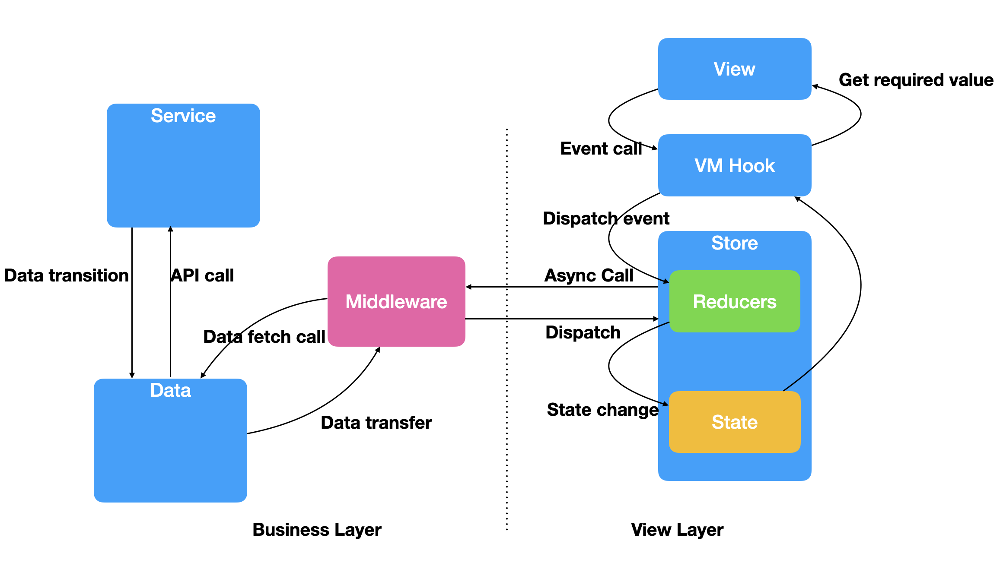

# Project Description
한스펠을 사용한 피그마 맞춤법 검사 플러그인입니다.

## Architecture

MVVM Architecture를 기반으로 하여 계층적인 구조를 가지도록 만듬  
각각의 계층은 바로 아래 계층만 바라보도록 되어있음.  
각 계층이 담당하는 역할에만 집중하면 되기 때문에, 확장 및 유지보수에 용이함  
단, 계층으로 구분되다 보니, 파일이 많아지고 런닝커브가 높다는 단점이 있음.

### View
> - Components
>   - Props로만 구성된 순수한 컴포넌트
> - Fragment
>   - VM을 가지고, state에 접근할 수 있는 컴포넌트 조합
> - Page
>   - Fragment들로 구성된 Page

### VM Hook
> Fragment가 필요한 데이터를 hook으로 분리하여 view는 필요한 값만 볼 수 있게 함

### Store
> 전역 store로 구성됨.
> view에서 사용될 state를 들고 있으며, VM Hook이 바라보는 값들임
> VM Hook에서 실행할 action도 같이 들고 있음

### Middleware
> React Toolkit Query의 middleware인 listener를 사용함.
> 비동기 로직에 대한 처리를 담당하며, API 호출 시 usecase를 통해 가공된 데이터를 받아옴.
> 가공된 데이터를 받아오면, dispatch로 action을 실행함

### Data
> Usecase 영역으로, 실제 API와 통신을 담당
> API로부터 받아온 데이터를 가공하여 middleware로 넘겨줌

### Service
> 실제 API들에 해당
> 가공되지 않은 원본 Response 값을 Data로 전달함
